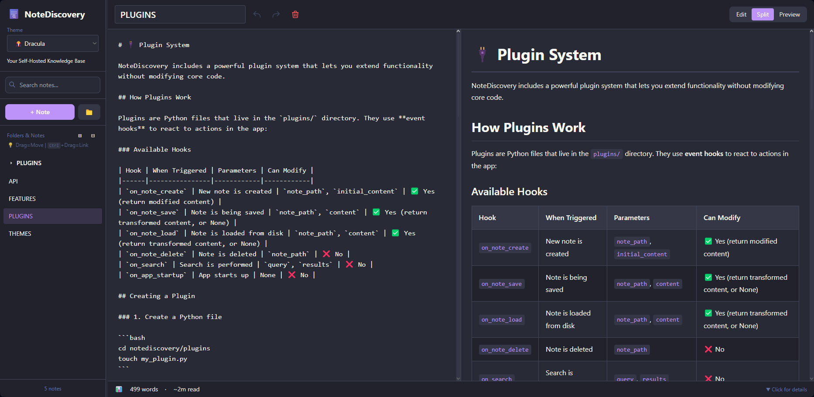

# 📝 NoteDiscovery

> Your Self-Hosted Knowledge Base

## What is NoteDiscovery?

NoteDiscovery is a **lightweight, self-hosted note-taking application** that puts you in complete control of your knowledge base. Write, organize, and discover your notes with a beautiful, modern interface—all running on your own server.



## 🎯 Who is it for?

- **Privacy-conscious users** who want complete control over their data
- **Developers** who prefer markdown and local file storage
- **Knowledge workers** building a personal wiki or second brain
- **Teams** looking for a self-hosted alternative to commercial apps
- **Anyone** who values simplicity, speed, and ownership

## ✨ Why NoteDiscovery?

### vs. Commercial Apps (Notion, Evernote, Obsidian Sync)

| Feature | NoteDiscovery | Commercial Apps |
|---------|---------------|-----------------|
| **Cost** | 100% Free | $xxx/month/year |
| **Privacy** | Your server, your data | Their servers, their terms |
| **Speed** | Lightning fast | Depends on internet |
| **Offline** | Always works | Limited or requires sync |
| **Customization** | Full control | Limited options |
| **No Lock-in** | Plain markdown files | Proprietary formats |

### Key Benefits

- 🔒 **Total Privacy** - Your notes never leave your server
- 💰 **Zero Cost** - No subscriptions, no hidden fees
- 🚀 **Fast & Lightweight** - Instant search and navigation
- 🎨 **Beautiful Themes** - Multiple themes, easy to customize
- 🔌 **Extensible** - Plugin system for custom features
- 📱 **Responsive** - Works on desktop, tablet, and mobile
- 📂 **Simple Storage** - Plain markdown files in folders

## 🚀 Quick Start

### Running from GitHub Container Registry (Easiest & Recommended)

Use the pre-built image directly from GHCR - no building required!

> **💡 Tip**: Always use `ghcr.io/gamosoft/notediscovery:latest` to get the newest features and fixes. Images are automatically built when PRs are merged to main.
>
> **🖥️ Multi-Architecture Support**: Images are built for `x86_64`, `ARM64` (Raspberry Pi 3/4/5), and `ARM v7` (older Raspberry Pi models). Docker will automatically pull the correct version for your device.

> **📁 Important - Volume Mapping**: The container needs local folders/files to work:
> - **Required**: `data` folder (your notes will be stored here)
> - **Required**: `themes` folder with theme `.css` files (at least light.css and dark.css)
> - **Required**: `plugins` folder (can be empty for basic functionality)
> - **Required**: `config.yaml` file (needed for the app to run)
> 
> **Setup Options:**
> 
> 1. **Minimal** (quick test - download just the essentials):
>    ```bash
>    # Linux/macOS
>    mkdir -p data plugins themes
>    curl -O https://raw.githubusercontent.com/gamosoft/notediscovery/main/config.yaml
>    # Download at least light and dark themes
>    curl -o themes/light.css https://raw.githubusercontent.com/gamosoft/notediscovery/main/themes/light.css
>    curl -o themes/dark.css https://raw.githubusercontent.com/gamosoft/notediscovery/main/themes/dark.css
>    ```
>    
>    ```powershell
>    # Windows PowerShell
>    mkdir data, plugins, themes -Force
>    Invoke-WebRequest -Uri https://raw.githubusercontent.com/gamosoft/notediscovery/main/config.yaml -OutFile config.yaml
>    # Download at least light and dark themes
>    Invoke-WebRequest -Uri https://raw.githubusercontent.com/gamosoft/notediscovery/main/themes/light.css -OutFile themes/light.css
>    Invoke-WebRequest -Uri https://raw.githubusercontent.com/gamosoft/notediscovery/main/themes/dark.css -OutFile themes/dark.css
>    ```
> 
> 2. **Full Setup** (recommended - includes all themes, plugins, sample notes):
>    ```bash
>    git clone https://github.com/gamosoft/notediscovery.git
>    cd notediscovery
>    # Now you have everything - run docker-compose below
>    ```

**Option 1: Docker Compose (Recommended)**

```bash
# Download the docker-compose file
curl -O https://raw.githubusercontent.com/gamosoft/notediscovery/main/docker-compose.ghcr.yml

# Or if you cloned the repo, just use it directly
docker-compose -f docker-compose.ghcr.yml up -d

# Access at http://localhost:8000

# View logs
docker-compose -f docker-compose.ghcr.yml logs -f

# Stop the application
docker-compose -f docker-compose.ghcr.yml down
```

**Option 2: Docker Run (Alternative)**

```bash
# Linux/macOS
docker run -d \
  --name notediscovery \
  -p 8000:8000 \
  -v $(pwd)/data:/app/data \
  -v $(pwd)/plugins:/app/plugins \
  -v $(pwd)/themes:/app/themes \
  -v $(pwd)/config.yaml:/app/config.yaml \
  --restart unless-stopped \
  ghcr.io/gamosoft/notediscovery:latest
```

```powershell
# Windows PowerShell
docker run -d `
  --name notediscovery `
  -p 8000:8000 `
  -v ${PWD}/data:/app/data `
  -v ${PWD}/plugins:/app/plugins `
  -v ${PWD}/themes:/app/themes `
  -v ${PWD}/config.yaml:/app/config.yaml `
  --restart unless-stopped `
  ghcr.io/gamosoft/notediscovery:latest
```

Access at http://localhost:8000

**Why use the GHCR image?**
- ✅ No build time - instant deployment
- ✅ Always up-to-date with the latest release
- ✅ Tested and verified builds
- ✅ Smaller download with optimized layers

### Running with Docker Compose (Recommended for Development)

Docker ensures consistent environment and easy deployment:

```bash
# Clone the repository
git clone https://github.com/gamosoft/notediscovery.git
cd notediscovery

# Start with Docker Compose
docker-compose up -d

# Access at http://localhost:8000

# View logs
docker-compose logs -f

# Stop the application
docker-compose down
```

**Requirements:**
- Docker
- Docker Compose

### Running Locally (Without Docker)

For development or if you prefer running directly:

```bash
# Clone the repository
git clone https://github.com/gamosoft/notediscovery.git
cd notediscovery

# Install dependencies
pip install -r requirements.txt

# Run the application
python run.py

# Access at http://localhost:8000
```

**Requirements:**
- Python 3.8 or higher
- pip (Python package manager)

**Dependencies installed:**
- FastAPI - Web framework
- Uvicorn - ASGI server
- PyYAML - Configuration handling
- aiofiles - Async file operations

## 📚 Documentation

Want to learn more? **The full documentation lives inside the app as interactive notes!**

Once you've started NoteDiscovery, you'll find comprehensive guides on:
- 🎨 **THEMES.md** - Theme customization and creating custom themes
- ✨ **FEATURES.md** - Complete feature list and keyboard shortcuts
- 🔌 **PLUGINS.md** - Plugin system and available plugins
- 🌐 **API.md** - REST API documentation and examples

**Can't wait to start the app?** Browse the documentation notes directly on GitHub in the [`data/notes/`](data/notes/) folder!

💡 **Tip:** These documentation files are regular markdown notes—edit them, add your own notes, or use them as templates. It's your knowledge base!

## 💖 Support Development

If you find NoteDiscovery useful, consider [☕ buying me a coffee](https://ko-fi.com/gamosoft) to help keep the project going. Every bit helps with new features, bug fixes, and improvements. Thank you!

## 🔒 Security Considerations

NoteDiscovery is designed for **self-hosted, private use**. Please keep these security considerations in mind:

### Network Security
- ⚠️ **Do NOT expose directly to the internet** without additional security measures
- Run behind a reverse proxy (nginx, Caddy) with HTTPS and authentication if needed
- Keep it on your local network or use a VPN for remote access
- By default, the app listens on `0.0.0.0:8000` (all network interfaces)

### No Built-in Authentication
- The app has **no authentication by design** (single-user, self-hosted)
- Anyone with network access can read and modify your notes
- Use network-level security (firewall, VPN) for access control
- Consider adding authentication via reverse proxy if needed

### Data Privacy
- Your notes are stored as **plain text markdown files** in `data/notes/`
- No data is sent to external services
- Regular backups are recommended

### Best Practices
- Run on `localhost` or a private network only
- Use Docker for isolation and easier security management
- Keep your system and dependencies updated
- Review and audit any plugins you install
- Set appropriate file permissions on the `data/` directory

**TL;DR**: Perfect for personal use on your local machine or home network. Add a reverse proxy with authentication if exposing to wider networks.

## 📄 License

MIT License - Free to use, modify, and distribute.

---

Made with ❤️ for the self-hosting community
