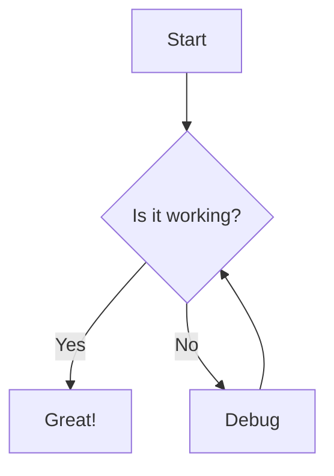

# ✨ Features

## 📝 Note Management

### Create & Edit
- **Rich markdown editor** with live preview
- **Three view modes**: Edit, Split, Preview
- **Auto-save** - Never lose your work
- **Undo/Redo** - Ctrl+Z / Ctrl+Y support
- **Syntax highlighting** for code blocks (50+ languages)
- **Copy code blocks** - One-click copy button on hover
- **LaTeX/Math rendering** - Beautiful mathematical equations with MathJax (see [MATHJAX.md](MATHJAX.md))
- **Mermaid diagrams** - Create flowcharts, sequence diagrams, and more (see [MERMAID.md](MERMAID.md))
- **HTML Export** - Export notes as standalone HTML files

### Image Support
- **Drag & drop upload** - Drop images from your file system directly into the editor
- **Clipboard paste** - Paste images from clipboard with Ctrl+V
- **Multiple formats** - Supports JPG, PNG, GIF, and WebP (max 10MB)

### Organization
- **Folder hierarchy** - Organize notes in nested folders
- **Drag & drop** - Move notes and folders effortlessly
- **Alphabetical sorting** - Find notes quickly
- **Rename anything** - Files and folders, instantly
- **Visual tree view** - Expandable/collapsible navigation

## 🔗 Linking & Discovery

### Internal Links
- **Wiki-style links** - `[[Note Name]]` syntax
- **Drag to link** - Drag notes or images into the editor to insert links
- **Click to navigate** - Jump between notes seamlessly
- **External links** - Open in new tabs automatically

### Direct URLs
- **Deep linking** - Open specific notes via URL (e.g., `/folder/note`)
- **Search highlighting** - Add `?search=term` to highlight specific content
- **Browser history** - Back/forward buttons navigate between notes
- **Shareable links** - Bookmark or share direct links to notes with highlighted terms
- **Refresh safe** - Page reload keeps you on the same note with search context

## 🎨 Customization

### Themes
- **8 built-in themes** - Light, Dark, Dracula, Nord, Monokai, Vue High Contrast, Cobalt2, VS Blue
- **Theme persistence** - Remembers your choice
- **Custom themes** - Create your own CSS themes
- **Instant switching** - No reload required

### Layout
- **Resizable sidebar** - Drag to adjust width
- **View mode memory** - Remembers Edit/Split/Preview preference
- **Responsive design** - Works on all screen sizes

## 📊 Note Statistics

### Built-in Plugin
- **Word count** - Track document length
- **Character count** - Including and excluding spaces
- **Reading time** - Estimated minutes to read
- **Line count** - Total lines in note
- **Image count** - Track embedded images
- **Link count** - Internal and external links
- **Expandable panel** - Toggle stats visibility

## 🔌 Plugin System

### Extensibility
- **Easy installation** - Drop Python files in `plugins/` folder
- **Hot reload** - Plugins detected on app restart
- **Toggle on/off** - Enable/disable without deleting
- **Event hooks** - React to note saves, deletes, searches
- **API access** - Full access to backend functionality

## 🔍 Search

- **Full-text search** - Find notes by content
- **Real-time results** - As you type
- **Highlight matches** - See context in results
- **In-note highlighting** - Search terms highlighted in open notes
- **Live highlighting** - Highlights update as you type or edit
- **Fast indexing** - Instant search across notes

## 🧮 Math & LaTeX Support

### Mathematical Notation
- **Inline math** - Use `$...$` or `\(...\)` for equations within text
- **Display math** - Use `$$...$$` or `\[...\]` for centered equations
- **Full LaTeX support** - Powered by MathJax 3
- **Greek letters** - `\alpha`, `\beta`, `\Gamma`, etc.
- **Matrices** - `\begin{bmatrix}...\end{bmatrix}`
- **Calculus** - Integrals, derivatives, limits
- **Symbols** - All standard mathematical symbols
- **Theme-aware** - Math colors adapt to your theme

### Example
```markdown
Einstein's equation: $E = mc^2$

The quadratic formula:
$$
x = \frac{-b \pm \sqrt{b^2-4ac}}{2a}
$$
```
Einstein's equation: $E = mc^2$

The quadratic formula:
$$
x = \frac{-b \pm \sqrt{b^2-4ac}}{2a}
$$

📄 **See the [MATHJAX](MATHJAX.md) note for more examples and syntax reference.**

## 📊 Mermaid Diagrams

### Visual Diagrams
- **Flowcharts** - Process flows and decision trees
- **Sequence diagrams** - System interactions over time
- **Class diagrams** - UML class relationships
- **State diagrams** - State machines and transitions
- **Gantt charts** - Project timelines
- **Pie charts** - Data visualization
- **Git graphs** - Branch and commit history
- **Theme support** - Adapts to your theme

### Example
````markdown

````

📄 **See the [MERMAID](MERMAID.md) note for diagram examples and syntax reference.**

## ⚡ Keyboard Shortcuts

| Windows/Linux | Mac | Action |
|---------------|-----|--------|
| `Ctrl+S` | `Cmd+S` | Save note |
| `Ctrl+Alt+N` | `Cmd+Option+N` | New note |
| `Ctrl+Alt+F` | `Cmd+Option+F` | New folder |
| `Ctrl+Z` | `Cmd+Z` | Undo |
| `Ctrl+Y` or `Ctrl+Shift+Z` | `Cmd+Y` or `Cmd+Shift+Z` | Redo |
| `F3` | `F3` | Next search match |
| `Shift+F3` | `Shift+F3` | Previous search match |

## 🚀 Performance

- **Instant loading** - No lag, no loading spinners
- **Efficient caching** - Smart local storage
- **Minimal resources** - Runs on modest hardware
- **No bloat** - Focused on what matters

---

💡 **Tip:** Explore the interface! Most features are discoverable through intuitive drag & drop and hover menus.

