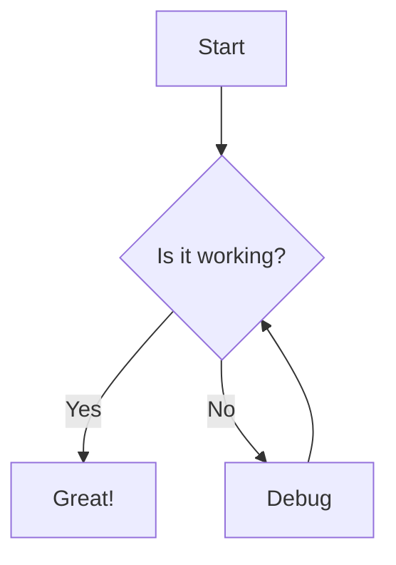

# ✨ Features

## 📝 Note Management

### Create & Edit
- **Rich markdown editor** with live preview
- **Three view modes**: Edit, Split, Preview
- **Auto-save** - Never lose your work
- **Undo/Redo** - Ctrl+Z / Ctrl+Y support
- **Note templates** - Create notes from templates with dynamic placeholders
- **Syntax highlighting** for code blocks (50+ languages)
- **Copy code blocks** - One-click copy button on hover
- **LaTeX/Math rendering** - Beautiful mathematical equations with MathJax (see [MATHJAX.md](MATHJAX.md))
- **Mermaid diagrams** - Create flowcharts, sequence diagrams, and more (see [MERMAID.md](MERMAID.md))
- **Public Sharing** - Share notes via token-based URLs with optional QR code for mobile (see [SHARING.md](SHARING.md))

### Media Support
- **Drag & drop upload** - Drop files from your file system directly into the editor
- **Clipboard paste** - Paste images from clipboard with Ctrl+V
- **Images** - JPG, PNG, GIF, WebP (default max 10MB, configurable)
- **Audio** - MP3, WAV, OGG, M4A (default max 50MB, configurable)
- **Video** - MP4, WebM, MOV, AVI (default max 100MB, configurable)
- **Documents** - PDF (default max 20MB, configurable)
- **In-app viewing** - View all media types directly in the sidebar
- **Inline preview** - Audio/video players and PDF viewer embedded in notes

### Organization
- **Folder hierarchy** - Organize notes in nested folders
- **Drag & drop** - Move notes and folders effortlessly
- **Flexible sorting** - Sort notes by name (A-Z, Z-A), date (newest, oldest), or size (largest, smallest)
- **Rename anything** - Files and folders, instantly
- **Visual tree view** - Expandable/collapsible navigation
- **Hide system folders** - Toggle to hide `_attachments`, `_templates` and other underscore-prefixed folders from sidebar
- **Tab inserts tab** - Toggle to make Tab key insert a tab character in the editor instead of changing focus

### Export & Print
- **HTML Export** - Download notes as standalone HTML files with all styling, images, diagrams, and math embedded
- **Print Preview** - Open note in new tab with Print/Close buttons for easy printing
- **Self-contained** - Exported files work offline with no dependencies
- **Theme-aware** - Export uses your current theme for consistent appearance
- **Full rendering** - MathJax equations, Mermaid diagrams, and syntax highlighting included

## 🔗 Linking & Discovery

### Graph View
- **Interactive graph** - Visualize all your notes and their connections
- **Navigate with mouse** - Drag to pan, scroll to zoom, double-click nodes to open notes
- **Multiple link types** - See wikilinks and markdown links distinguished by color
- **Theme-aware** - Graph colors adapt to your current theme

### Internal Links
- **Wikilinks** - `[[Note Name]]` Obsidian-style syntax for quick linking
- **Wikilinks with display text** - `[[Note Name|Click here]]` to customize link text
- **Section anchors** - `[[Note Name#heading]]` to link directly to a heading
- **Same-page anchors** - `[[#heading]]` to link within the current note
- **Broken link detection** - Non-existent note links shown dimmed
- **Markdown links** - `[text](note.md)` standard syntax also supported
- **Markdown section links** - `[text](note.md#heading)` for heading anchors
- **Drag to link** - Drag notes or images into the editor to insert links
- **Click to navigate** - Jump between notes seamlessly
- **External links** - Open in new tabs automatically
- **URI protocols** - Supports `mailto:`, `tel:`, `ssh:`, `ftp:`, `slack:`, `discord:`, `teams:`, `zoom:`, `whatsapp:`, `telegram:`, `signal:`, `spotify:`, `steam:`, `magnet:`, and more

### Outline Panel
- **Table of Contents** - View all headings (H1-H6) in sidebar
- **Click to navigate** - Jump to any heading in edit or preview mode
- **Real-time updates** - Outline updates as you type
- **Hierarchical view** - Indentation shows heading structure
- **Heading count badge** - Quick indicator of document structure

### Backlinks
- **Reverse link discovery** - See which notes link TO the current note
- **Context snippets** - Preview the surrounding text where links appear
- **Line numbers** - Know exactly where each reference is located
- **Link type detection** - Distinguishes wikilinks from markdown links
- **API access** - Query backlinks programmatically via REST API
- **MCP integration** - AI assistants can discover note relationships

### Section Link Syntax
To link to a heading, convert the heading text to a slug: **lowercase, spaces → dashes, remove special chars**.

| Heading | Slug | Link Example |
|---------|------|--------------|
| `## Getting Started` | `getting-started` | `[[note#getting-started]]` |
| `### API Reference` | `api-reference` | `[API](note#api-reference)` |
| `## What's New?` | `whats-new` | `[[#whats-new]]` (same page) |

### Direct URLs
- **Deep linking** - Open specific notes via URL (e.g., `/folder/note`)
- **Search highlighting** - Add `?search=term` to highlight specific content
- **Browser history** - Back/forward buttons navigate between notes
- **Shareable links** - Bookmark or share direct links to notes with highlighted terms
- **Refresh safe** - Page reload keeps you on the same note with search context
- **Copy link button** - One-click copy of note URL to clipboard
- **Last edited indicator** - Shows relative time since last edit (e.g., "Edited 2h ago")
- **Favorites** - Star notes for quick access; displayed at top of sidebar

## 🎨 Customization

### Themes
- **8 built-in themes** - Light, Dark, Dracula, Nord, Monokai, Vue High Contrast, Cobalt2, VS Blue
- **Theme persistence** - Remembers your choice
- **Custom themes** - Create your own CSS themes
- **Instant switching** - No reload required

### Layout
- **Resizable sidebar** - Drag to adjust width
- **View mode memory** - Remembers Edit/Split/Preview preference
- **Responsive design** - Works on all screen sizes

## 📊 Note Statistics

### Built-in Plugin
- **Word count** - Track document length
- **Character count** - Including and excluding spaces
- **Reading time** - Estimated minutes to read
- **Line count** - Total lines in note
- **Image count** - Track embedded images
- **Link count** - Internal and external links (includes wikilinks)
- **Wikilink count** - Separate count for `[[wikilinks]]`
- **Expandable panel** - Toggle stats visibility

## 🔌 Plugin System

### Extensibility
- **Easy installation** - Drop Python files in `plugins/` folder
- **Hot reload** - Plugins detected on app restart
- **Toggle on/off** - Enable/disable without deleting
- **Event hooks** - React to note saves, deletes, searches
- **API access** - Full access to backend functionality

## 🏷️ Tags

Organize notes with tags defined in YAML frontmatter. See **[TAGS.md](TAGS.md)** for complete guide.

### Quick Start
```markdown
---
tags: [python, tutorial, backend]
---

# Your Note Content
```

### Features
- **Click to filter** - Select tags to show matching notes
- **Multiple tags** - Combine tags (AND logic - all must match)
- **Tag counts** - See how many notes use each tag
- **Collapsible panel** - Saves state across sessions
- **Auto-sync** - Updates after saving notes

## ⚙️ Note Properties Panel

View and interact with YAML frontmatter metadata directly in the preview.

### Features
- **Collapsible panel** - Compact bar at the top of preview, expands on click
- **Auto-hides** - Only appears when note has frontmatter
- **Clickable tags** - Filter notes by clicking any tag
- **Smart formatting** - Dates formatted nicely, booleans shown as ✓/✗
- **URL detection** - Links in metadata are clickable
- **Real-time updates** - Changes as you edit frontmatter
- **Performance optimized** - Cached parsing, no re-parse if unchanged

### Collapsed View
Shows tags as pills plus up to 3 priority fields (date, author, status, etc.)

### Expanded View
Click to expand and see all metadata fields in a clean grid layout.

### Supported Formats
```yaml
---
tags: [project, important]     # Inline array
date: 2024-01-15               # Formatted as "Jan 15, 2024"
author: John Doe               # String value
status: draft                  # String value
priority: high                 # String value
source: https://example.com    # Clickable link
draft: true                    # Shows as "✓ Yes"
custom-field: any value        # Keys with hyphens supported
items:                         # YAML list format
  - item 1
  - item 2
---
```

## 🔍 Search & Filtering

### Text Search
- **Content-only** - Searches note contents (not file/folder names)
- **Real-time results** - As you type
- **Highlight matches** - See context in results
- **In-note highlighting** - Search terms highlighted in open notes
- **Live highlighting** - Highlights update as you type or edit

### Combined Filtering
- **Tags + Search** - Combine text search with tag filters
- **Smart display** - Shows flat list when filtering, tree view when browsing
- **Empty states** - Clear "no matches" message with quick actions

## 🧮 Math & LaTeX Support

### Mathematical Notation
- **Inline math** - Use `$...$` or `\(...\)` for equations within text
- **Display math** - Use `$$...$$` or `\[...\]` for centered equations
- **Full LaTeX support** - Powered by MathJax 3
- **Greek letters** - `\alpha`, `\beta`, `\Gamma`, etc.
- **Matrices** - `\begin{bmatrix}...\end{bmatrix}`
- **Calculus** - Integrals, derivatives, limits
- **Symbols** - All standard mathematical symbols
- **Theme-aware** - Math colors adapt to your theme

### Example
```markdown
Einstein's equation: $E = mc^2$

The quadratic formula:
$$
x = \frac{-b \pm \sqrt{b^2-4ac}}{2a}
$$
```
Einstein's equation: $E = mc^2$

The quadratic formula:
$$
x = \frac{-b \pm \sqrt{b^2-4ac}}{2a}
$$

📄 **See the [MATHJAX](MATHJAX.md) note for more examples and syntax reference.**

## 📊 Mermaid Diagrams

### Visual Diagrams
- **Flowcharts** - Process flows and decision trees
- **Sequence diagrams** - System interactions over time
- **Class diagrams** - UML class relationships
- **State diagrams** - State machines and transitions
- **Gantt charts** - Project timelines
- **Pie charts** - Data visualization
- **Git graphs** - Branch and commit history
- **Theme support** - Adapts to your theme

### Example
````markdown

```mermaid
graph TD
    A[Start] --> B{Is it working?}
    B -->|Yes| C[Great!]
    B -->|No| D[Debug]
    D --> B
```
````

📄 **See the [MERMAID](MERMAID.md) note for diagram examples and syntax reference.**

## 📄 Note Templates

Create notes from reusable templates with dynamic placeholder replacement.

### Creating Templates
1. Create markdown files in `data/_templates/` folder
2. Use placeholders for dynamic content
3. Templates appear in the "New from Template" menu

### Available Placeholders
- `{{date}}` - Current date (YYYY-MM-DD)
- `{{time}}` - Current time (HH:MM:SS)
- `{{datetime}}` - Current date and time
- `{{timestamp}}` - Unix timestamp
- `{{year}}` - Current year (YYYY)
- `{{month}}` - Current month (MM)
- `{{day}}` - Current day (DD)
- `{{title}}` - Note name (without extension)
- `{{folder}}` - Parent folder name

### Example Template
```markdown
---
tags: [meeting]
date: {{date}}
---

# {{title}}

**Created:** {{datetime}}

## Notes

```

### Using Templates
1. Click the "New" dropdown button
2. Select "New from Template"
3. Choose a template and enter a note name
4. The new note will be created with placeholders replaced

### Built-in Templates
- **meeting-notes** - Template for meeting notes
- **daily-journal** - Daily journal with morning goals and evening reflection
- **project-plan** - Project planning template with objectives and timeline

📚 **See [TEMPLATES.md](TEMPLATES.md)** for detailed documentation and example templates you can copy to your instance.

## ⚡ Keyboard Shortcuts

### General

| Windows/Linux | Mac | Action |
|---------------|-----|--------|
| `Ctrl+Alt+P` | `Cmd+Option+P` | Quick Switcher (jump to any note) |
| `Ctrl+S` | `Cmd+S` | Save note |
| `Ctrl+Alt+N` | `Cmd+Option+N` | New note |
| `Ctrl+Alt+F` | `Cmd+Option+F` | New folder |
| `Ctrl+Z` | `Cmd+Z` | Undo |
| `Ctrl+Y` or `Ctrl+Shift+Z` | `Cmd+Y` or `Cmd+Shift+Z` | Redo |
| `Ctrl+Alt+Z` | `Cmd+Option+Z` | Toggle Zen Mode |
| `Esc` | `Esc` | Exit Zen Mode |
| `F3` | `F3` | Next search match |
| `Shift+F3` | `Shift+F3` | Previous search match |

> **Note for Mac users:** Some Option-based shortcuts (`Cmd+Option+N/F/T`) may conflict with browser shortcuts in Chrome/Brave. Safari has better compatibility. If shortcuts don't work, try using `Ctrl` instead of `Cmd`, or use the UI buttons.

### Markdown Formatting

| Windows/Linux | Mac | Action | Result |
|---------------|-----|--------|--------|
| `Ctrl+B` | `Cmd+B` | Bold | `**text**` |
| `Ctrl+I` | `Cmd+I` | Italic | `*text*` |
| `Ctrl+K` | `Cmd+K` | Insert link (in editor) | `[text](url)` |
| `Ctrl+Alt+T` | `Cmd+Option+T` | Insert table | 3x3 table placeholder |

> **Tip:** Use `Ctrl+Alt+P` to quickly jump to any note from anywhere in the app.

## 🧘 Zen Mode

Full immersive distraction-free writing experience:

- **Full screen** - Uses browser Fullscreen API for true immersion
- **Hidden UI** - Sidebar, toolbar, and stats bar disappear
- **Centered editor** - Comfortable width for optimal reading
- **Larger text** - 18px font size with relaxed line spacing
- **Quick access** - Button in toolbar or `Ctrl+Alt+Z` / `Cmd+Option+Z` shortcut
- **Easy exit** - Press `Esc`, click exit button, or use shortcut again
- **State preserved** - Returns to your previous view mode on exit

## 📱 Progressive Web App (PWA)

NoteDiscovery can be installed as a standalone app on your device:

- **Install as app** - Add to home screen on mobile, or install via browser on desktop
- **Standalone mode** - Runs without browser chrome for a native app feel

### How to Install
- **Desktop (Chrome/Edge)**: Click the install icon in the address bar, or Menu → "Install NoteDiscovery"
- **Android**: Chrome Menu → "Add to Home Screen"
- **iOS**: Safari Share → "Add to Home Screen"

## 🌍 Internationalization

- **Multiple languages** - English, Spanish, German, French built-in
- **Easy to add** - Drop JSON files in `locales/` folder
- **Instant switch** - Change language in Settings without reload
- **Community translations** - Contributions welcome!

## 🔐 Authentication

- **Password protection** - Single-user login system
- **Session-based auth** - Secure cookie-based sessions (7 days default)
- **API key support** - Bearer token or `X-API-Key` header for external integrations
- **Environment overrides** - Configure via env vars for Docker deployments

📄 **See [AUTHENTICATION.md](AUTHENTICATION.md)** for setup guide.

## 🤖 AI Integration (MCP)

Built-in **Model Context Protocol (MCP)** server for AI assistant integration:

- **Search notes** - AI can search through your knowledge base
- **Read content** - AI can read and understand your notes
- **Browse tags** - AI understands your organization
- **Create notes** - AI can save summaries and insights
- **Knowledge graph** - AI can explore note relationships
- **Discover backlinks** - AI can find what notes reference a specific note
- **Zero setup** - Works with Docker or Python, just add config to Cursor/Claude

### Quick Setup (Docker)
```json
{
  "mcpServers": {
    "notediscovery": {
      "command": "docker",
      "args": ["run", "--rm", "-i", "ghcr.io/gamosoft/notediscovery:latest", "python", "-m", "mcp_server"],
      "env": { "NOTEDISCOVERY_URL": "http://host.docker.internal:8000" }
    }
  }
}
```

📄 **See [MCP.md](MCP.md)** for complete setup guide.

## 🚀 Performance

- **Instant loading** - No lag, no loading spinners
- **Efficient caching** - Smart local storage
- **Minimal resources** - Runs on modest hardware
- **No bloat** - Focused on what matters
- **Lightweight** - No heavy frameworks

---

💡 **Tip:** Explore the interface! Most features are discoverable through intuitive drag & drop and hover menus.

